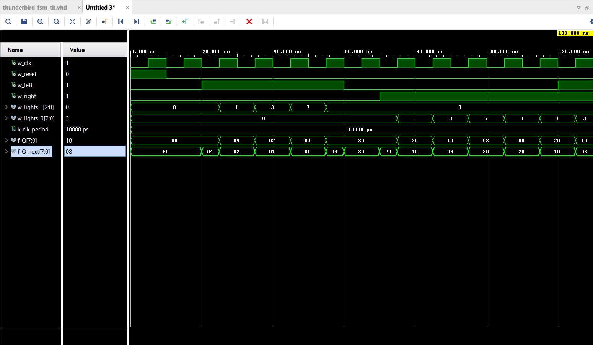

# Lab 3: Thunderbird Turn Signal

VHDL for ECE 281 [Lab 3](https://usafa-ece.github.io/ece281-book/lab/lab3.html)

Targeted toward Digilent Basys3. Make sure to install the [board files](https://github.com/Xilinx/XilinxBoardStore/tree/2018.2/boards/Digilent/basys3).

Built for Vivado 2024.2 on Windows 11.

<<<<<<< HEAD
!\[Waveform from thunderbird\_fsm\_tb](waveform.png)
=======

>>>>>>> a6785f1b70aa605a998a4416b157f15b7967f2c0

